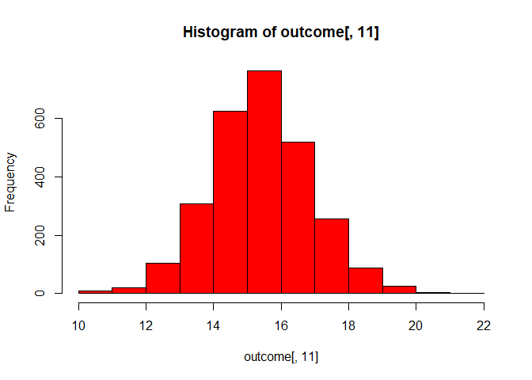

-   [1. Plot the 30-day Mortality Rates for Heart Attack](#plot-the-30-day-mortality-rates-for-heart-attack)
    -   [Load dataset and observe structure](#load-dataset-and-observe-structure)
    -   [Fix column classes](#fix-column-classes)
    -   [Plot 30 day mortality rates for heart attack](#plot-30-day-mortality-rates-for-heart-attack)
-   [Find the best hospital in a state](#find-the-best-hospital-in-a-state)
-   [Rank hospitals by outcome in a state](#rank-hospitals-by-outcome-in-a-state)
-   [Rank hospitals in all states](#rank-hospitals-in-all-states)

1. Plot the 30-day Mortality Rates for Heart Attack
===================================================

Load dataset and observe structure
----------------------------------

``` r
outcome <- read.csv("D:/Data Science/Coursera/Data Science Specialization/R Programming Assignment/datasciencecoursera/02-RProgramming/Week 4 Assignment/Data/outcome-of-care-measures.csv", colClasses = "character")
head(outcome)
```

    ##   Provider.Number                    Hospital.Name
    ## 1          010001 SOUTHEAST ALABAMA MEDICAL CENTER
    ## 2          010005    MARSHALL MEDICAL CENTER SOUTH
    ## 3          010006   ELIZA COFFEE MEMORIAL HOSPITAL
    ## 4          010007         MIZELL MEMORIAL HOSPITAL
    ## 5          010008      CRENSHAW COMMUNITY HOSPITAL
    ## 6          010010    MARSHALL MEDICAL CENTER NORTH
    ##                    Address.1 Address.2 Address.3         City State
    ## 1     1108 ROSS CLARK CIRCLE                           DOTHAN    AL
    ## 2 2505 U S HIGHWAY 431 NORTH                             BOAZ    AL
    ## 3         205 MARENGO STREET                         FLORENCE    AL
    ## 4              702 N MAIN ST                              OPP    AL
    ## 5        101 HOSPITAL CIRCLE                          LUVERNE    AL
    ## 6    8000 ALABAMA HIGHWAY 69                     GUNTERSVILLE    AL
    ##   ZIP.Code County.Name Phone.Number
    ## 1    36301     HOUSTON   3347938701
    ## 2    35957    MARSHALL   2565938310
    ## 3    35631  LAUDERDALE   2567688400
    ## 4    36467   COVINGTON   3344933541
    ## 5    36049    CRENSHAW   3343353374
    ## 6    35976    MARSHALL   2565718000
    ##   Hospital.30.Day.Death..Mortality..Rates.from.Heart.Attack
    ## 1                                                      14.3
    ## 2                                                      18.5
    ## 3                                                      18.1
    ## 4                                             Not Available
    ## 5                                             Not Available
    ## 6                                             Not Available
    ##   Comparison.to.U.S..Rate...Hospital.30.Day.Death..Mortality..Rates.from.Heart.Attack
    ## 1                                                No Different than U.S. National Rate
    ## 2                                                No Different than U.S. National Rate
    ## 3                                                No Different than U.S. National Rate
    ## 4                                                           Number of Cases Too Small
    ## 5                                                           Number of Cases Too Small
    ## 6                                                           Number of Cases Too Small
    ##   Lower.Mortality.Estimate...Hospital.30.Day.Death..Mortality..Rates.from.Heart.Attack
    ## 1                                                                                 12.1
    ## 2                                                                                 14.7
    ## 3                                                                                 14.8
    ## 4                                                                        Not Available
    ## 5                                                                        Not Available
    ## 6                                                                        Not Available
    ##   Upper.Mortality.Estimate...Hospital.30.Day.Death..Mortality..Rates.from.Heart.Attack
    ## 1                                                                                 17.0
    ## 2                                                                                 23.0
    ## 3                                                                                 21.8
    ## 4                                                                        Not Available
    ## 5                                                                        Not Available
    ## 6                                                                        Not Available
    ##   Number.of.Patients...Hospital.30.Day.Death..Mortality..Rates.from.Heart.Attack
    ## 1                                                                            666
    ## 2                                                                             44
    ## 3                                                                            329
    ## 4                                                                             14
    ## 5                                                                              9
    ## 6                                                                             22
    ##                                Footnote...Hospital.30.Day.Death..Mortality..Rates.from.Heart.Attack
    ## 1                                                                                                  
    ## 2                                                                                                  
    ## 3                                                                                                  
    ## 4 number of cases is too small (fewer than 25) to reliably tell how well the hospital is performing
    ## 5 number of cases is too small (fewer than 25) to reliably tell how well the hospital is performing
    ## 6 number of cases is too small (fewer than 25) to reliably tell how well the hospital is performing
    ##   Hospital.30.Day.Death..Mortality..Rates.from.Heart.Failure
    ## 1                                                       11.4
    ## 2                                                       15.2
    ## 3                                                       11.3
    ## 4                                                       13.6
    ## 5                                                       13.8
    ## 6                                                       12.5
    ##   Comparison.to.U.S..Rate...Hospital.30.Day.Death..Mortality..Rates.from.Heart.Failure
    ## 1                                                 No Different than U.S. National Rate
    ## 2                                                        Worse than U.S. National Rate
    ## 3                                                 No Different than U.S. National Rate
    ## 4                                                 No Different than U.S. National Rate
    ## 5                                                 No Different than U.S. National Rate
    ## 6                                                 No Different than U.S. National Rate
    ##   Lower.Mortality.Estimate...Hospital.30.Day.Death..Mortality..Rates.from.Heart.Failure
    ## 1                                                                                   9.5
    ## 2                                                                                  12.2
    ## 3                                                                                   9.1
    ## 4                                                                                  10.0
    ## 5                                                                                   9.9
    ## 6                                                                                   9.9
    ##   Upper.Mortality.Estimate...Hospital.30.Day.Death..Mortality..Rates.from.Heart.Failure
    ## 1                                                                                  13.7
    ## 2                                                                                  18.8
    ## 3                                                                                  13.9
    ## 4                                                                                  18.2
    ## 5                                                                                  18.7
    ## 6                                                                                  15.6
    ##   Number.of.Patients...Hospital.30.Day.Death..Mortality..Rates.from.Heart.Failure
    ## 1                                                                             741
    ## 2                                                                             234
    ## 3                                                                             523
    ## 4                                                                             113
    ## 5                                                                              53
    ## 6                                                                             163
    ##   Footnote...Hospital.30.Day.Death..Mortality..Rates.from.Heart.Failure
    ## 1                                                                      
    ## 2                                                                      
    ## 3                                                                      
    ## 4                                                                      
    ## 5                                                                      
    ## 6                                                                      
    ##   Hospital.30.Day.Death..Mortality..Rates.from.Pneumonia
    ## 1                                                   10.9
    ## 2                                                   13.9
    ## 3                                                   13.4
    ## 4                                                   14.9
    ## 5                                                   15.8
    ## 6                                                    8.7
    ##   Comparison.to.U.S..Rate...Hospital.30.Day.Death..Mortality..Rates.from.Pneumonia
    ## 1                                             No Different than U.S. National Rate
    ## 2                                             No Different than U.S. National Rate
    ## 3                                             No Different than U.S. National Rate
    ## 4                                             No Different than U.S. National Rate
    ## 5                                             No Different than U.S. National Rate
    ## 6                                                   Better than U.S. National Rate
    ##   Lower.Mortality.Estimate...Hospital.30.Day.Death..Mortality..Rates.from.Pneumonia
    ## 1                                                                               8.6
    ## 2                                                                              11.3
    ## 3                                                                              11.2
    ## 4                                                                              11.6
    ## 5                                                                              11.4
    ## 6                                                                               6.8
    ##   Upper.Mortality.Estimate...Hospital.30.Day.Death..Mortality..Rates.from.Pneumonia
    ## 1                                                                              13.7
    ## 2                                                                              17.0
    ## 3                                                                              15.8
    ## 4                                                                              19.0
    ## 5                                                                              21.5
    ## 6                                                                              11.0
    ##   Number.of.Patients...Hospital.30.Day.Death..Mortality..Rates.from.Pneumonia
    ## 1                                                                         371
    ## 2                                                                         372
    ## 3                                                                         836
    ## 4                                                                         239
    ## 5                                                                          61
    ## 6                                                                         315
    ##   Footnote...Hospital.30.Day.Death..Mortality..Rates.from.Pneumonia
    ## 1                                                                  
    ## 2                                                                  
    ## 3                                                                  
    ## 4                                                                  
    ## 5                                                                  
    ## 6                                                                  
    ##   Hospital.30.Day.Readmission.Rates.from.Heart.Attack
    ## 1                                                19.0
    ## 2                                       Not Available
    ## 3                                                17.8
    ## 4                                       Not Available
    ## 5                                       Not Available
    ## 6                                       Not Available
    ##   Comparison.to.U.S..Rate...Hospital.30.Day.Readmission.Rates.from.Heart.Attack
    ## 1                                          No Different than U.S. National Rate
    ## 2                                                     Number of Cases Too Small
    ## 3                                          No Different than U.S. National Rate
    ## 4                                                     Number of Cases Too Small
    ## 5                                                     Number of Cases Too Small
    ## 6                                                     Number of Cases Too Small
    ##   Lower.Readmission.Estimate...Hospital.30.Day.Readmission.Rates.from.Heart.Attack
    ## 1                                                                             16.6
    ## 2                                                                    Not Available
    ## 3                                                                             14.9
    ## 4                                                                    Not Available
    ## 5                                                                    Not Available
    ## 6                                                                    Not Available
    ##   Upper.Readmission.Estimate...Hospital.30.Day.Readmission.Rates.from.Heart.Attack
    ## 1                                                                             21.7
    ## 2                                                                    Not Available
    ## 3                                                                             21.5
    ## 4                                                                    Not Available
    ## 5                                                                    Not Available
    ## 6                                                                    Not Available
    ##   Number.of.Patients...Hospital.30.Day.Readmission.Rates.from.Heart.Attack
    ## 1                                                                      728
    ## 2                                                                       21
    ## 3                                                                      342
    ## 4                                                                        1
    ## 5                                                                        4
    ## 6                                                                       13
    ##                                      Footnote...Hospital.30.Day.Readmission.Rates.from.Heart.Attack
    ## 1                                                                                                  
    ## 2 number of cases is too small (fewer than 25) to reliably tell how well the hospital is performing
    ## 3                                                                                                  
    ## 4 number of cases is too small (fewer than 25) to reliably tell how well the hospital is performing
    ## 5 number of cases is too small (fewer than 25) to reliably tell how well the hospital is performing
    ## 6 number of cases is too small (fewer than 25) to reliably tell how well the hospital is performing
    ##   Hospital.30.Day.Readmission.Rates.from.Heart.Failure
    ## 1                                                 23.7
    ## 2                                                 22.5
    ## 3                                                 19.8
    ## 4                                                 27.1
    ## 5                                                 24.7
    ## 6                                                 23.9
    ##   Comparison.to.U.S..Rate...Hospital.30.Day.Readmission.Rates.from.Heart.Failure
    ## 1                                           No Different than U.S. National Rate
    ## 2                                           No Different than U.S. National Rate
    ## 3                                                 Better than U.S. National Rate
    ## 4                                           No Different than U.S. National Rate
    ## 5                                           No Different than U.S. National Rate
    ## 6                                           No Different than U.S. National Rate
    ##   Lower.Readmission.Estimate...Hospital.30.Day.Readmission.Rates.from.Heart.Failure
    ## 1                                                                              21.3
    ## 2                                                                              19.2
    ## 3                                                                              17.2
    ## 4                                                                              22.4
    ## 5                                                                              19.9
    ## 6                                                                              20.1
    ##   Upper.Readmission.Estimate...Hospital.30.Day.Readmission.Rates.from.Heart.Failure
    ## 1                                                                              26.5
    ## 2                                                                              26.1
    ## 3                                                                              22.9
    ## 4                                                                              31.9
    ## 5                                                                              30.2
    ## 6                                                                              28.2
    ##   Number.of.Patients...Hospital.30.Day.Readmission.Rates.from.Heart.Failure
    ## 1                                                                       891
    ## 2                                                                       264
    ## 3                                                                       614
    ## 4                                                                       135
    ## 5                                                                        59
    ## 6                                                                       173
    ##   Footnote...Hospital.30.Day.Readmission.Rates.from.Heart.Failure
    ## 1                                                                
    ## 2                                                                
    ## 3                                                                
    ## 4                                                                
    ## 5                                                                
    ## 6                                                                
    ##   Hospital.30.Day.Readmission.Rates.from.Pneumonia
    ## 1                                             17.1
    ## 2                                             17.6
    ## 3                                             16.9
    ## 4                                             19.4
    ## 5                                             18.0
    ## 6                                             18.7
    ##   Comparison.to.U.S..Rate...Hospital.30.Day.Readmission.Rates.from.Pneumonia
    ## 1                                       No Different than U.S. National Rate
    ## 2                                       No Different than U.S. National Rate
    ## 3                                       No Different than U.S. National Rate
    ## 4                                       No Different than U.S. National Rate
    ## 5                                       No Different than U.S. National Rate
    ## 6                                       No Different than U.S. National Rate
    ##   Lower.Readmission.Estimate...Hospital.30.Day.Readmission.Rates.from.Pneumonia
    ## 1                                                                          14.4
    ## 2                                                                          15.0
    ## 3                                                                          14.7
    ## 4                                                                          15.9
    ## 5                                                                          14.0
    ## 6                                                                          15.7
    ##   Upper.Readmission.Estimate...Hospital.30.Day.Readmission.Rates.from.Pneumonia
    ## 1                                                                          20.4
    ## 2                                                                          20.6
    ## 3                                                                          19.5
    ## 4                                                                          23.2
    ## 5                                                                          22.8
    ## 6                                                                          22.2
    ##   Number.of.Patients...Hospital.30.Day.Readmission.Rates.from.Pneumonia
    ## 1                                                                   400
    ## 2                                                                   374
    ## 3                                                                   842
    ## 4                                                                   254
    ## 5                                                                    56
    ## 6                                                                   326
    ##   Footnote...Hospital.30.Day.Readmission.Rates.from.Pneumonia
    ## 1                                                            
    ## 2                                                            
    ## 3                                                            
    ## 4                                                            
    ## 5                                                            
    ## 6

``` r
str(outcome)
```

    ## 'data.frame':    4706 obs. of  46 variables:
    ##  $ Provider.Number                                                                      : chr  "010001" "010005" "010006" "010007" ...
    ##  $ Hospital.Name                                                                        : chr  "SOUTHEAST ALABAMA MEDICAL CENTER" "MARSHALL MEDICAL CENTER SOUTH" "ELIZA COFFEE MEMORIAL HOSPITAL" "MIZELL MEMORIAL HOSPITAL" ...
    ##  $ Address.1                                                                            : chr  "1108 ROSS CLARK CIRCLE" "2505 U S HIGHWAY 431 NORTH" "205 MARENGO STREET" "702 N MAIN ST" ...
    ##  $ Address.2                                                                            : chr  "" "" "" "" ...
    ##  $ Address.3                                                                            : chr  "" "" "" "" ...
    ##  $ City                                                                                 : chr  "DOTHAN" "BOAZ" "FLORENCE" "OPP" ...
    ##  $ State                                                                                : chr  "AL" "AL" "AL" "AL" ...
    ##  $ ZIP.Code                                                                             : chr  "36301" "35957" "35631" "36467" ...
    ##  $ County.Name                                                                          : chr  "HOUSTON" "MARSHALL" "LAUDERDALE" "COVINGTON" ...
    ##  $ Phone.Number                                                                         : chr  "3347938701" "2565938310" "2567688400" "3344933541" ...
    ##  $ Hospital.30.Day.Death..Mortality..Rates.from.Heart.Attack                            : chr  "14.3" "18.5" "18.1" "Not Available" ...
    ##  $ Comparison.to.U.S..Rate...Hospital.30.Day.Death..Mortality..Rates.from.Heart.Attack  : chr  "No Different than U.S. National Rate" "No Different than U.S. National Rate" "No Different than U.S. National Rate" "Number of Cases Too Small" ...
    ##  $ Lower.Mortality.Estimate...Hospital.30.Day.Death..Mortality..Rates.from.Heart.Attack : chr  "12.1" "14.7" "14.8" "Not Available" ...
    ##  $ Upper.Mortality.Estimate...Hospital.30.Day.Death..Mortality..Rates.from.Heart.Attack : chr  "17.0" "23.0" "21.8" "Not Available" ...
    ##  $ Number.of.Patients...Hospital.30.Day.Death..Mortality..Rates.from.Heart.Attack       : chr  "666" "44" "329" "14" ...
    ##  $ Footnote...Hospital.30.Day.Death..Mortality..Rates.from.Heart.Attack                 : chr  "" "" "" "number of cases is too small (fewer than 25) to reliably tell how well the hospital is performing" ...
    ##  $ Hospital.30.Day.Death..Mortality..Rates.from.Heart.Failure                           : chr  "11.4" "15.2" "11.3" "13.6" ...
    ##  $ Comparison.to.U.S..Rate...Hospital.30.Day.Death..Mortality..Rates.from.Heart.Failure : chr  "No Different than U.S. National Rate" "Worse than U.S. National Rate" "No Different than U.S. National Rate" "No Different than U.S. National Rate" ...
    ##  $ Lower.Mortality.Estimate...Hospital.30.Day.Death..Mortality..Rates.from.Heart.Failure: chr  "9.5" "12.2" "9.1" "10.0" ...
    ##  $ Upper.Mortality.Estimate...Hospital.30.Day.Death..Mortality..Rates.from.Heart.Failure: chr  "13.7" "18.8" "13.9" "18.2" ...
    ##  $ Number.of.Patients...Hospital.30.Day.Death..Mortality..Rates.from.Heart.Failure      : chr  "741" "234" "523" "113" ...
    ##  $ Footnote...Hospital.30.Day.Death..Mortality..Rates.from.Heart.Failure                : chr  "" "" "" "" ...
    ##  $ Hospital.30.Day.Death..Mortality..Rates.from.Pneumonia                               : chr  "10.9" "13.9" "13.4" "14.9" ...
    ##  $ Comparison.to.U.S..Rate...Hospital.30.Day.Death..Mortality..Rates.from.Pneumonia     : chr  "No Different than U.S. National Rate" "No Different than U.S. National Rate" "No Different than U.S. National Rate" "No Different than U.S. National Rate" ...
    ##  $ Lower.Mortality.Estimate...Hospital.30.Day.Death..Mortality..Rates.from.Pneumonia    : chr  "8.6" "11.3" "11.2" "11.6" ...
    ##  $ Upper.Mortality.Estimate...Hospital.30.Day.Death..Mortality..Rates.from.Pneumonia    : chr  "13.7" "17.0" "15.8" "19.0" ...
    ##  $ Number.of.Patients...Hospital.30.Day.Death..Mortality..Rates.from.Pneumonia          : chr  "371" "372" "836" "239" ...
    ##  $ Footnote...Hospital.30.Day.Death..Mortality..Rates.from.Pneumonia                    : chr  "" "" "" "" ...
    ##  $ Hospital.30.Day.Readmission.Rates.from.Heart.Attack                                  : chr  "19.0" "Not Available" "17.8" "Not Available" ...
    ##  $ Comparison.to.U.S..Rate...Hospital.30.Day.Readmission.Rates.from.Heart.Attack        : chr  "No Different than U.S. National Rate" "Number of Cases Too Small" "No Different than U.S. National Rate" "Number of Cases Too Small" ...
    ##  $ Lower.Readmission.Estimate...Hospital.30.Day.Readmission.Rates.from.Heart.Attack     : chr  "16.6" "Not Available" "14.9" "Not Available" ...
    ##  $ Upper.Readmission.Estimate...Hospital.30.Day.Readmission.Rates.from.Heart.Attack     : chr  "21.7" "Not Available" "21.5" "Not Available" ...
    ##  $ Number.of.Patients...Hospital.30.Day.Readmission.Rates.from.Heart.Attack             : chr  "728" "21" "342" "1" ...
    ##  $ Footnote...Hospital.30.Day.Readmission.Rates.from.Heart.Attack                       : chr  "" "number of cases is too small (fewer than 25) to reliably tell how well the hospital is performing" "" "number of cases is too small (fewer than 25) to reliably tell how well the hospital is performing" ...
    ##  $ Hospital.30.Day.Readmission.Rates.from.Heart.Failure                                 : chr  "23.7" "22.5" "19.8" "27.1" ...
    ##  $ Comparison.to.U.S..Rate...Hospital.30.Day.Readmission.Rates.from.Heart.Failure       : chr  "No Different than U.S. National Rate" "No Different than U.S. National Rate" "Better than U.S. National Rate" "No Different than U.S. National Rate" ...
    ##  $ Lower.Readmission.Estimate...Hospital.30.Day.Readmission.Rates.from.Heart.Failure    : chr  "21.3" "19.2" "17.2" "22.4" ...
    ##  $ Upper.Readmission.Estimate...Hospital.30.Day.Readmission.Rates.from.Heart.Failure    : chr  "26.5" "26.1" "22.9" "31.9" ...
    ##  $ Number.of.Patients...Hospital.30.Day.Readmission.Rates.from.Heart.Failure            : chr  "891" "264" "614" "135" ...
    ##  $ Footnote...Hospital.30.Day.Readmission.Rates.from.Heart.Failure                      : chr  "" "" "" "" ...
    ##  $ Hospital.30.Day.Readmission.Rates.from.Pneumonia                                     : chr  "17.1" "17.6" "16.9" "19.4" ...
    ##  $ Comparison.to.U.S..Rate...Hospital.30.Day.Readmission.Rates.from.Pneumonia           : chr  "No Different than U.S. National Rate" "No Different than U.S. National Rate" "No Different than U.S. National Rate" "No Different than U.S. National Rate" ...
    ##  $ Lower.Readmission.Estimate...Hospital.30.Day.Readmission.Rates.from.Pneumonia        : chr  "14.4" "15.0" "14.7" "15.9" ...
    ##  $ Upper.Readmission.Estimate...Hospital.30.Day.Readmission.Rates.from.Pneumonia        : chr  "20.4" "20.6" "19.5" "23.2" ...
    ##  $ Number.of.Patients...Hospital.30.Day.Readmission.Rates.from.Pneumonia                : chr  "400" "374" "842" "254" ...
    ##  $ Footnote...Hospital.30.Day.Readmission.Rates.from.Pneumonia                          : chr  "" "" "" "" ...

Fix column classes
------------------

``` r
outcome[,11] <- as.numeric(outcome[,11])
```

    ## Warning: NAs introduced by coercion

``` r
outcome[,13] <- as.numeric(outcome[,13])
```

    ## Warning: NAs introduced by coercion

``` r
outcome[,14] <- as.numeric(outcome[,14])
```

    ## Warning: NAs introduced by coercion

``` r
outcome[,15] <- as.numeric(outcome[,15])
```

    ## Warning: NAs introduced by coercion

``` r
outcome[,17] <- as.numeric(outcome[,17])
```

    ## Warning: NAs introduced by coercion

``` r
outcome[,19] <- as.numeric(outcome[,19])
```

    ## Warning: NAs introduced by coercion

``` r
outcome[,20] <- as.numeric(outcome[,20])
```

    ## Warning: NAs introduced by coercion

``` r
outcome[,21] <- as.numeric(outcome[,21])
```

    ## Warning: NAs introduced by coercion

``` r
outcome[,23] <- as.numeric(outcome[,23])
```

    ## Warning: NAs introduced by coercion

``` r
outcome[,25] <- as.numeric(outcome[,25])
```

    ## Warning: NAs introduced by coercion

``` r
outcome[,26] <- as.numeric(outcome[,26])
```

    ## Warning: NAs introduced by coercion

``` r
outcome[,27] <- as.numeric(outcome[,27])
```

    ## Warning: NAs introduced by coercion

``` r
outcome[,29] <- as.numeric(outcome[,29])
```

    ## Warning: NAs introduced by coercion

``` r
outcome[,31] <- as.numeric(outcome[,31])
```

    ## Warning: NAs introduced by coercion

``` r
outcome[,32] <- as.numeric(outcome[,32])
```

    ## Warning: NAs introduced by coercion

``` r
outcome[,34] <- as.numeric(outcome[,34])
```

    ## Warning: NAs introduced by coercion

``` r
outcome[,35] <- as.numeric(outcome[,35])
```

    ## Warning: NAs introduced by coercion

``` r
outcome[,36] <- as.numeric(outcome[,36])
```

    ## Warning: NAs introduced by coercion

``` r
outcome[,37] <- as.numeric(outcome[,37])
```

    ## Warning: NAs introduced by coercion

``` r
outcome[,38] <- as.numeric(outcome[,38])
```

    ## Warning: NAs introduced by coercion

``` r
outcome[,39] <- as.numeric(outcome[,39])
```

    ## Warning: NAs introduced by coercion

``` r
outcome[,41] <- as.numeric(outcome[,41])
```

    ## Warning: NAs introduced by coercion

``` r
outcome[,43] <- as.numeric(outcome[,43])
```

    ## Warning: NAs introduced by coercion

``` r
outcome[,44] <- as.numeric(outcome[,44])
```

    ## Warning: NAs introduced by coercion

``` r
outcome[,45] <- as.numeric(outcome[,45])
```

    ## Warning: NAs introduced by coercion

``` r
outcome[,12] <- as.factor(outcome[,12])
outcome[,18] <- as.factor(outcome[,18])
outcome[,24] <- as.factor(outcome[,24])
outcome[,30] <- as.factor(outcome[,30])
outcome[,36] <- as.factor(outcome[,36])
outcome[,42] <- as.factor(outcome[,42])
```

Plot 30 day mortality rates for heart attack
--------------------------------------------

``` r
hist(outcome[,11], col = "red")
```



Find the best hospital in a state
=================================

``` r
source("best.R")
best("TX", "heart attack")
```

    ## Warning in lapply(X = X, FUN = FUN, ...): NAs introduced by coercion

    ## Warning in lapply(X = X, FUN = FUN, ...): NAs introduced by coercion

    ## Warning in lapply(X = X, FUN = FUN, ...): NAs introduced by coercion

    ## [1] "CYPRESS FAIRBANKS MEDICAL CENTER"

``` r
best("TX", "heart failure")
```

    ## Warning in lapply(X = X, FUN = FUN, ...): NAs introduced by coercion

    ## Warning in lapply(X = X, FUN = FUN, ...): NAs introduced by coercion

    ## Warning in lapply(X = X, FUN = FUN, ...): NAs introduced by coercion

    ## [1] "FORT DUNCAN MEDICAL CENTER"

``` r
best("MD", "heart attack")
```

    ## Warning in lapply(X = X, FUN = FUN, ...): NAs introduced by coercion

    ## Warning in lapply(X = X, FUN = FUN, ...): NAs introduced by coercion

    ## Warning in lapply(X = X, FUN = FUN, ...): NAs introduced by coercion

    ## [1] "JOHNS HOPKINS HOSPITAL, THE"

``` r
best("MD", "pneumonia")
```

    ## Warning in lapply(X = X, FUN = FUN, ...): NAs introduced by coercion

    ## Warning in lapply(X = X, FUN = FUN, ...): NAs introduced by coercion

    ## Warning in lapply(X = X, FUN = FUN, ...): NAs introduced by coercion

    ## [1] "GREATER BALTIMORE MEDICAL CENTER"

Rank hospitals by outcome in a state
====================================

``` r
source("rankhospital.R")
rankhospital("TX", "heart failure", 4)
```

    ## Warning in lapply(X = X, FUN = FUN, ...): NAs introduced by coercion

    ## Warning in lapply(X = X, FUN = FUN, ...): NAs introduced by coercion

    ## Warning in lapply(X = X, FUN = FUN, ...): NAs introduced by coercion

    ## [1] "DETAR HOSPITAL NAVARRO"

``` r
rankhospital("MD", "heart attack", "worst")
```

    ## Warning in lapply(X = X, FUN = FUN, ...): NAs introduced by coercion

    ## Warning in lapply(X = X, FUN = FUN, ...): NAs introduced by coercion

    ## Warning in lapply(X = X, FUN = FUN, ...): NAs introduced by coercion

    ## [1] "HARFORD MEMORIAL HOSPITAL"

``` r
rankhospital("MN", "heart attack", 5000)
```

    ## Warning in lapply(X = X, FUN = FUN, ...): NAs introduced by coercion

    ## Warning in lapply(X = X, FUN = FUN, ...): NAs introduced by coercion

    ## Warning in lapply(X = X, FUN = FUN, ...): NAs introduced by coercion

    ## [1] NA

Rank hospitals in all states
============================

``` r
source("rankall.R")
head(rankall("heart attack", 20), 10)
```

    ## Warning in lapply(X = X, FUN = FUN, ...): NAs introduced by coercion

    ## Warning in lapply(X = X, FUN = FUN, ...): NAs introduced by coercion

    ## Warning in lapply(X = X, FUN = FUN, ...): NAs introduced by coercion

    ##    Hospital.Name                         State
    ## AK "NA"                                  "NA" 
    ## AL "D W MCMILLAN MEMORIAL HOSPITAL"      "AL" 
    ## AR "ARKANSAS METHODIST MEDICAL CENTER"   "AR" 
    ## AZ "JOHN C LINCOLN DEER VALLEY HOSPITAL" "AZ" 
    ## CA "SHERMAN OAKS HOSPITAL"               "CA" 
    ## CO "SKY RIDGE MEDICAL CENTER"            "CO" 
    ## CT "MIDSTATE MEDICAL CENTER"             "CT" 
    ## DC "NA"                                  "NA" 
    ## DE "NA"                                  "NA" 
    ## FL "SOUTH FLORIDA BAPTIST HOSPITAL"      "FL"

``` r
tail(rankall("pneumonia", "worst"), 3)
```

    ## Warning in lapply(X = X, FUN = FUN, ...): NAs introduced by coercion

    ## Warning in lapply(X = X, FUN = FUN, ...): NAs introduced by coercion

    ## Warning in lapply(X = X, FUN = FUN, ...): NAs introduced by coercion

    ##    Hospital.Name                                State
    ## WI "MAYO CLINIC HEALTH SYSTEM - NORTHLAND, INC" "WI" 
    ## WV "PLATEAU MEDICAL CENTER"                     "WV" 
    ## WY "NORTH BIG HORN HOSPITAL DISTRICT"           "WY"

``` r
tail(rankall("heart failure"), 10)
```

    ## Warning in lapply(X = X, FUN = FUN, ...): NAs introduced by coercion

    ## Warning in lapply(X = X, FUN = FUN, ...): NAs introduced by coercion

    ## Warning in lapply(X = X, FUN = FUN, ...): NAs introduced by coercion

    ##    Hospital.Name                                                      
    ## TN "WELLMONT HAWKINS COUNTY MEMORIAL HOSPITAL"                        
    ## TX "FORT DUNCAN MEDICAL CENTER"                                       
    ## UT "VA SALT LAKE CITY HEALTHCARE - GEORGE E. WAHLEN VA MEDICAL CENTER"
    ## VA "SENTARA POTOMAC HOSPITAL"                                         
    ## VI "GOV JUAN F LUIS HOSPITAL & MEDICAL CTR"                           
    ## VT "SPRINGFIELD HOSPITAL"                                             
    ## WA "HARBORVIEW MEDICAL CENTER"                                        
    ## WI "AURORA ST LUKES MEDICAL CENTER"                                   
    ## WV "FAIRMONT GENERAL HOSPITAL"                                        
    ## WY "CHEYENNE VA MEDICAL CENTER"                                       
    ##    State
    ## TN "TN" 
    ## TX "TX" 
    ## UT "UT" 
    ## VA "VA" 
    ## VI "VI" 
    ## VT "VT" 
    ## WA "WA" 
    ## WI "WI" 
    ## WV "WV" 
    ## WY "WY"
